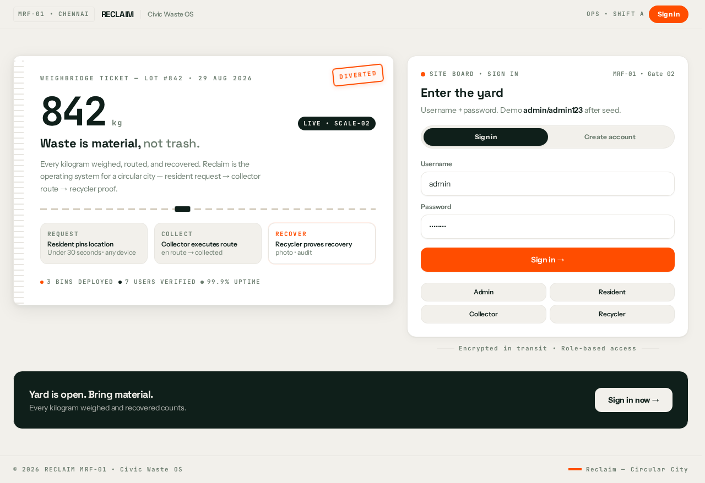
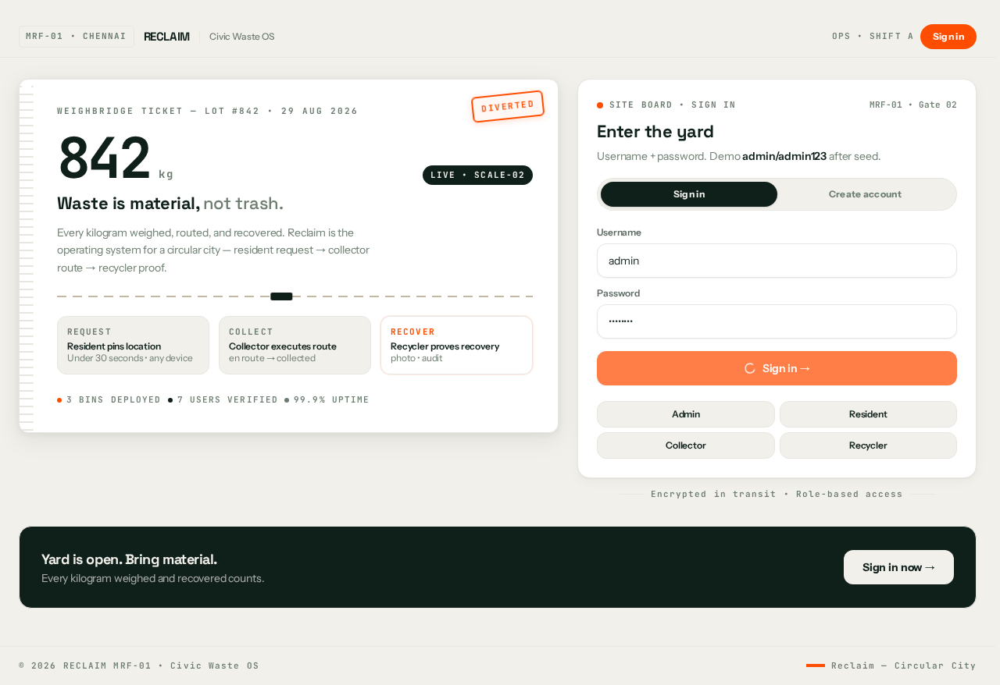
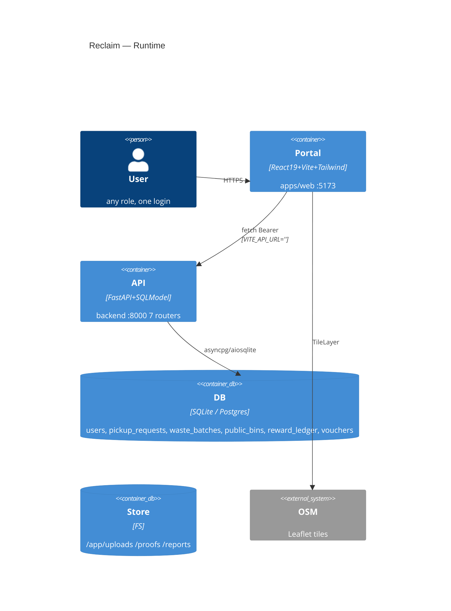

# ♻️ Reclaim — Civic Waste OS

<p align="center">
  
  
  
  
</p>

<p align="center">
  <b>Role-based waste collection & recovery OS — one login, four portals, zero waste.</b><br/>
  <i>Resident → Collector → Recycler → Admin • Leaflet + JWT • SQLite (dev) / Postgres (prod)</i>
</p>

<p align="center">
  <a href="#-quick-start">Quick Start</a> • <a href="docs/architecture.md">Architecture</a> • <a href="docs/api.md">API</a> • <a href="docs/deployment.md">Deploy</a> • <a href="docs/development.md">Develop</a>
</p>

---

## 🌿 Why Reclaim

> *Waste is material, not trash.* Reclaim routes every kilogram from household → collector fleet → recycler proof → city analytics. One `npm` workspace, one `5173` portal, one `8000` API.

**Theme:** *Botanical Garden* — Fern `#4a7c59` (primary), Marigold `#f9a620` (accent), Terracotta `#b7472a` (warm), Cream `#f5f3ed` (paper). Built for `Forest Canopy`-grade sustainability storytelling.

---

## 📸 Live Screenshots

### Home — Sign In


### Admin Dashboard


---

## ✨ Key Features

| Role | Portal | Capabilities |
|------|--------|--------------|
| **Resident** `user` | `/:5173` `Welcome back` | 📍 **Pinpoint marker** (draggable red `PIN` — tap map or drag pin, not cursor crosshair) • `New Pickup` `wasteType × kg → CO₂` • `My Requests` live status • `My Rewards` `balance/lifetime` • `Disposal Sites` **6** bins (see seed) • `Account` |
| **Collector** `collector` | `Queue / My Route / Schedule` | `GET /collector/pickups/available` • `accept → en_route → collected` (creates `WasteBatch AVAILABLE` + awards points) • `OSRM` trip `RouteMap` • `Drop-off Sites` |
| **Recycler** `recycler` | `Available / My Batches / Plant Analytics` | `Claim → Confirm Handover → Upload Proof` (`ACCEPTED → COMPLETED` now fixes `Mass Recycled 0`) • `Analytics 25kg` (`metal 15 + plastic 10`) `+ Refresh` button • `DonutChart` by `waste_type` |
| **Admin** `management` | `City Operations / Sites / Users / Vouchers / Audit / Reports` | `6` `PublicBins` editable + draggable • `Users` `Provision Account` • `Vouchers` catalogue • `CSV` `utf-8-sig` `rewards/vouchers/redemptions` + `users/pickups/batches/bins` • `Reports` download via `/uploads` |

---

## 🧱 Tech Stack (verified via Context7)

| Layer | Choice | Why |
|-------|--------|-----|
| **Backend** | `FastAPI 0.141` + `SQLModel 0.0.42` + `Uvicorn` + `SlowAPI` | Async, auto OpenAPI, `pydantic[email]` validation, rate-limit `5/min` on `POST /auth/login` |
| **DB** | `SQLite + aiosqlite` (dev `./test.db`) → `/app/data/waste.db` (`sqlite_data` volume) <br/>`PostgreSQL + asyncpg` (prod) | `AUTO_SEED=1` idempotent `seed_demo` → survives `down -v` / Render ephemeral |
| **Auth** | `Argon2` `passlib`, `python-jose[cryptography]` JWT `access 30m / refresh 7d` `HS256` | `OAuth2PasswordBearer` `tokenUrl=/auth/login` JSON `{username,password}` |
| **Frontend** | `React 19.2` `Vite 8.2` `Tailwind 4.3` `Leaflet 1.9` `Lucide` | `React.lazy → DonutChart/BinMap` `manualChunks: react-vendor, leaflet` `1888 modules` `typecheck 0` |
| **Infra** | `podman-compose.yml` `backend:8000` `frontend:80` + `Containerfile` `python:3.12-slim` `curl` + `node:20-alpine → nginx:alpine` | `nginx try_files $uri /index.html` |
| **Maps** | `react-leaflet` `OSM` `project-osrm.org` | `BinMap` `createCustomPin` `pickupPinIcon` red `PIN` draggable |

---

## 🗺️ Architecture (C4)



**Monorepo:**

```
waste-management/
├─ apps/web/              @wm/web :5173 portal (role-switched AppShell)
├─ packages/shared/        @wm/shared tokens, primitives, apiRequest, auth, router, BinMap, PickupCard
├─ backend/                FastAPI + Alembic + seed_demo
├─ podman-compose.yml      backend:8000 + frontend:80 + sqlite_data + upload_data
└─ start.sh                venv + deps + migrations + uvicorn + vite
```

---

## 🚀 Quick Start (SQLite, no containers — 30s)

```bash
# 1. Install
npm install
python3.12 -m venv .venv && source .venv/bin/activate
pip install -r backend/requirements.txt "pydantic[email]" python-multipart

# 2. Env (auto via start.sh, or manually)
cp .env.example .env   # DATABASE_URL=sqlite+aiosqlite:///./test.db  JWT_SECRET_KEY=supersecretkey

# 3. One-command dev (venv + vite)
./start.sh
# → Backend http://127.0.0.1:8000 (health /docs) + Portal http://127.0.0.1:5173

# Manual alternative:
DATABASE_URL=sqlite+aiosqlite:///./test.db PYTHONPATH=backend .venv/bin/uvicorn app.main:app --host 127.0.0.1 --port 8000 &
npm run dev -w @wm/web
```

**Podman (prod-like):**

```bash
podman-compose -f podman-compose.yml up -d --build
# → :8000 backend (healthy), :80 frontend
podman ps  # waste-backend healthy, waste-frontend
curl http://localhost:8000/health # {"status":"ok"}
# wipe + auto-reseed demo 25kg + 6 bins + 5 vouchers (idempotent)
podman-compose down -v && podman-compose up -d
```

---

## 🔑 Demo Credentials (auto-seeded)

`AUTO_SEED=1` (default) `seed_demo` runs on `uvicorn` startup if `COUNT(users)==0` → survives `down -v` / Render redeploy (`AUTO_SEED=0` for prod).

| Role | Username | Password | Portal |
|------|----------|----------|--------|
| Resident | `user1` | `user123` | `5173` |
| Collector | `collector1` | `collector123` | `5173` |
| Recycler | `recycler1` | `recycler123` | `5173` |
| Admin | `admin` | `admin123` | `5173` |
| Admin1 | `admin1` | `admin123` | `5173` |

Self-register `Create account` is **resident-only**; `collector/recycler/admin` via **Admin → Users → Provision Account**.

**Seeded demo network:**

- `6` Public Bins: `Marina Beach 13.05,80.2827` `T Nagar 13.0418,80.2341` `Adyar 13.0067,80.2570` `Anna Nagar 13.085,80.2101` `Velachery 12.9815,80.218` `Guindy 13.0063,80.2206` — `GET /user/bins 6`
- `4` Pickups → `4` Batches: `metal 15kg + plastic 10kg → COMPLETED 25kg` (Plant Analytics), `organic 8kg + e-waste 12kg → AVAILABLE`
- `5` Vouchers: `₹100 Off 100pts` `Eco Kit 150` `Compost Bin 300` `Recycle Hero 50` `Free Pickup 5kg 200`
- `RewardBalance user1 250` `ledger 2`

---

## 📊 Data Model & KPI Logic

- `PickupRequest.quantity_kg >0` → `Collector COLLECTED` → `WasteBatch(AVAILABLE)` → `Recycler REQUESTED → ACCEPTED → proof COMPLETED` (`backend/app/api/recycler.py:285` `if != COMPLETED → COMPLETED + award_points`).
- `Plant Analytics` `total_kg_processed = SUM(PickupRequest.quantity_kg) JOIN WasteBatch WHERE recycler_id==me AND status==COMPLETED` `25.0` (`metal 15 + plastic 10`).
- `Reward: points = floor(kg × rate)` `REWARD_RATES: organic5, plastic10, e-waste15, metal10...` idempotent on `pickup_id`.

---

## 🔌 API Surface (7 routers + health + docs)

| Prefix | File | Key Routes |
|--------|------|------------|
| `POST /auth` | `backend/app/api/auth.py:21` | `POST /login {username,password} → {access_token,refresh_token,role}` `POST /register` `POST /refresh` `GET /me` |
| `/user` | `user.py:13` | `GET /bins` `POST /pickups` `GET /pickups` `GET /analytics/summary` |
| `/collector` | `collector.py:14` | `GET /pickups/available` `POST /pickups/{id}/accept` `PUT /pickups/{id}/status {en_route,collected}` `GET /bins` |
| `/recycler` | `recycler.py:19` | `GET /batches` `GET /batches/my` `POST /batches/{id}/request` `POST /batches/{id}/accept` `POST /batches/{id}/proof` `GET /analytics/summary` |
| `/management` | `management.py:26` | `GET /dashboard/summary` `POST /bins` `GET /bins` `POST /users` `DELETE /users/{id}` `POST /reports/{type}` `GET /reports` |
| `/rewards` | `rewards.py:9` | `GET /rates` `GET /balance` `GET /history` |
| `/vouchers` | `vouchers.py:18` | `GET /vouchers` `GET /all` `POST /redeem/{id}` `POST /` `PATCH /{id}` `DELETE` `GET /redemptions` `PATCH /redemptions/{id} {issued,cancelled}` |
| | `main.py:88` | `GET /health {"status":"ok"}` `GET /docs` `/redoc` `/openapi.json` `GET /uploads/*` `GET /* → index.html` (SPA fallback) |

**Auth:** `Authorization: Bearer <access_token>` `localStorage wm_access_token/refresh_token/role` `packages/shared/src/auth.tsx`.

---

## 📦 CSV Reports

`POST /management/reports/{type}` `require_management` writes `uploads/reports/{type}_{uuid8}.csv` `utf-8-sig` BOM (Excel) `QUOTE_MINIMAL` `isoformat` dates, then `Report(file_url=/uploads/reports/...)` `GET /management/reports` lists, `GET /uploads/reports/*.csv 200` via `StaticFiles` (`main.py:93` always mounted, before SPA `404` handler `138`).

**Types:** `users | pickups | batches | bins | rewards | vouchers | redemptions` — validated before file creation, `OSError` → `500`, empty tables still write header.

**Frontend:** `ManagementDashboard.tsx:374` `Data Exports` `4 → 7` cards → `GET file_url` Download.

---

## 🗺️ Maps & Pinpoint

- **BinMap** `packages/shared/src/components/map/BinMap.tsx:10` `createCustomPin` `pickupPinIcon` red `#FF4D00` `PIN` badge `iconSize 36` `createCustomPin` per `waste_type`.
- **Resident `New Pickup`** `ResidentDashboard.tsx:528` `Label Pin on map — drag pinpoint` `LazyBinMap bins={bins} editable={false} pickupPin={[lat,lng]} onPickupDrag={setLatLng} onPick={setLatLng}` `height 420` `Drag map • Tap to drop pin • Locate me` — **pinpoint marker replaces crosshair cursor**, draggable + click-to-place.
- **Admin `Deploy Bin`** `ManagementDashboard.tsx:652` same `pickupPin={!selectedBin?[binForm.lat,lng]:null}` for new bin.

---

## ✅ Tests

```bash
PYTHONPATH=backend UPLOAD_DIR=/tmp/test-uploads .venv/bin/pytest backend/tests -v
# 20 passed, 1 warning (argon2 __version__ deprecated)
npm run typecheck  # tsc --noEmit 0 errors
npm run build      # 1888 modules → dist/index.html 2.25kB assets 64k
```

`podman-compose down -v && up -d` → `GET /recycler/analytics/summary 25.0` `GET /user/bins 6` `GET /vouchers 5` `POST /management/reports/users 200`.

---

## 📂 Project Structure

```
apps/web/               unified portal
packages/shared/         @wm/shared — design-system
backend/                 FastAPI + SQLModel + Alembic
  app/api/               7 routers + deps (RBAC)
  app/models/            User, PickupRequest, WasteBatch, PublicBin, RewardLedger, Voucher
  app/services/rewards.py
  app/db/seed_demo.py    idempotent demo 25kg + 6 bins + 5 vouchers
  app/main.py            create_all + backfill + AUTO_SEED + SPA fallback + uploads mount
docs/                    architecture, api, deployment, development, database, frontend, glossary
```

---

## 📚 Docs Dictionary

| Doc | Purpose |
|-----|---------|
| `docs/architecture.md` | C4, containers, monorepo, data flow |
| `docs/api.md` | 7 routers, auth, RBAC, schemas |
| `docs/deployment.md` | Podman, Render, Nginx/Caddy, ENV, Voroa MCP |
| `docs/development.md` | Setup, scripts, testing |
| `docs/database.md` | Models, Alembic, seed, sqlite vs postgres |
| `docs/frontend.md` | Portal, lazy chunks, BinMap, pinpoint |
| `docs/glossary.md` | Domain terms (pickup, batch, bin, voucher) |

---

## 📝 License & Credits

`MIT` `LICENSE` • `Reclaim MRF-01 • Chennai` • Stack: `FastAPI` `React` `Vite` `Tailwind` `Leaflet` `Podman` • Icons `Lucide` • Fonts `Space Grotesk / Instrument Sans / JetBrains Mono` • Theme `Botanical Garden` `Fern #4a7c59 / Marigold #f9a620`.