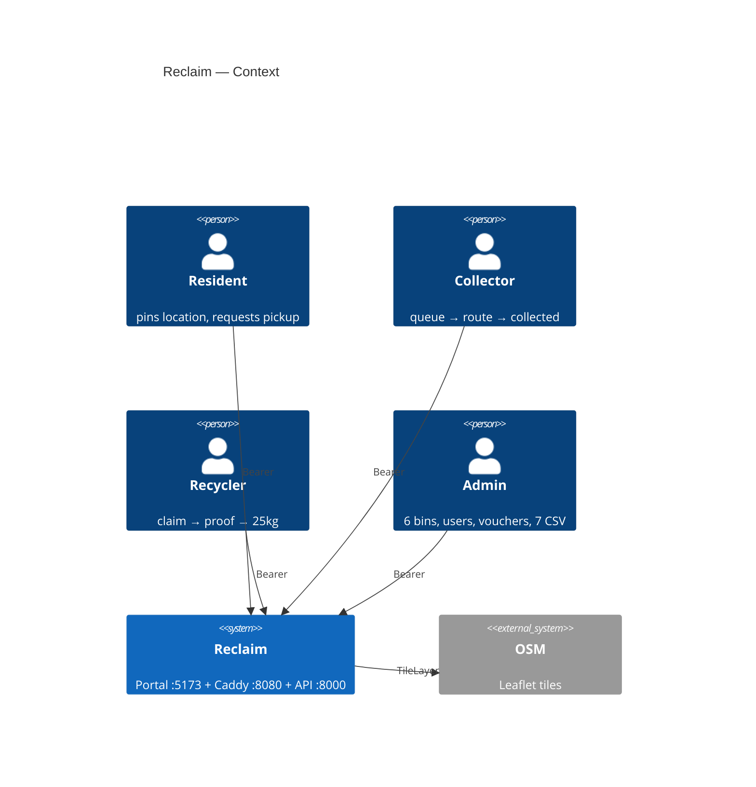
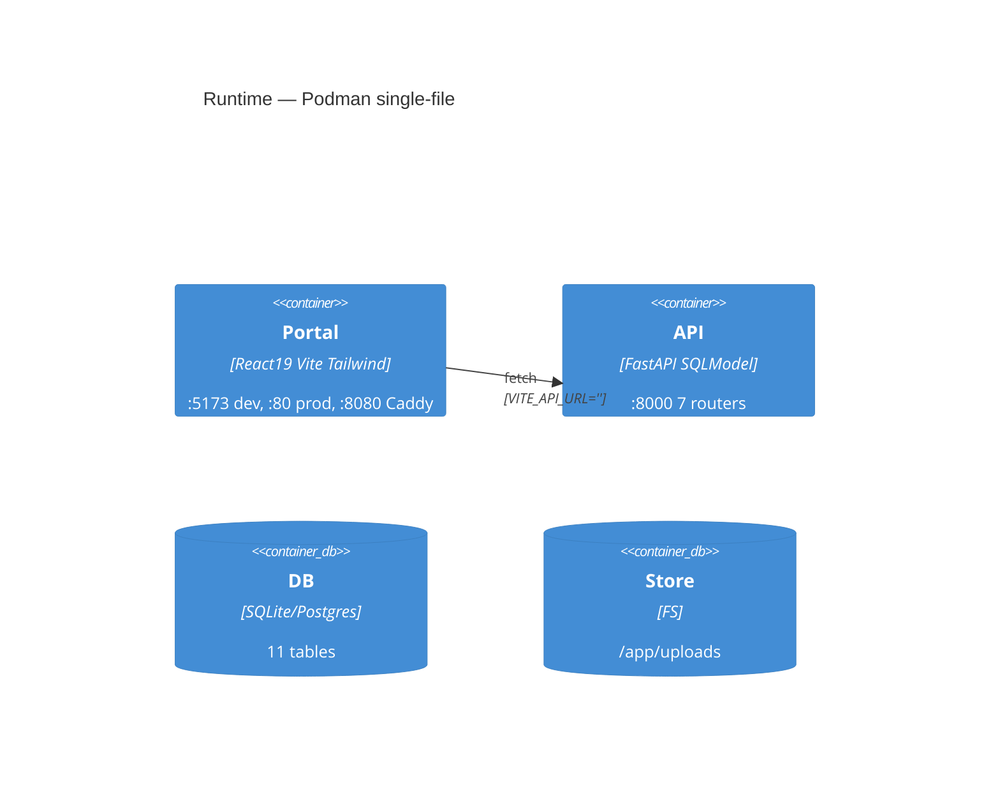

# Architecture — Reclaim Civic Waste OS

> **Botanical Garden** `Fern #4a7c59` `Cream #f5f3ed` • `C4` + `Container` + `Monorepo` • `FastAPI + React 19 + Vite 8 + Podman`

## 1. Executive Summary

One `5173` portal, one `8000` API, four roles. `user1` `collector1` `recycler1` `admin` via `POST /auth/login` JSON → `role`-switched `AppShell`. `SQLite` dev `./test.db` → `Postgres` prod, `AUTO_SEED=1` survives `down -v` / Render ephemeral with `25kg` demo.

**Live:** [`https://wms.getvoroa.com`](https://wms.getvoroa.com) `health /health` `MCP voroa` `Dockerfile /` `PYTHONPATH=/app:/app/backend` `branch main`.

## 2. System Context (C4 L1)



## 3. Containers (C4 L2)



| Port | Service | Image | Health |
|------|---------|-------|--------|
| `8000` | `backend` | `python:3.12-slim` `curl` | `GET /health 200` |
| `80` | `frontend` | `node:20-alpine → nginx:alpine` `try_files` | `GET / 200` |
| `8080` | `caddy` | `caddy:2-alpine` `handle /auth* → backend` `handle { frontend }` | `GET /health via :8080` |
| `5173` | `vite` | `dev` `proxy /auth → :8000` | `GET / 200` |

## 4. Monorepo

```
apps/web/               @wm/web — App.tsx role switch → Resident/Collector/Recycler/Management
packages/shared/         @wm/shared — tokens.css, apiRequest, AuthProvider, Router, BinMap, PickupCard, charts
backend/app/             api/ (7) + models/ + services/rewards.py + db/seed_demo.py + main.py (SPA fallback + uploads mount)
podman-compose.yml       backend:8000 + frontend:80 + caddy:8080 + sqlite_data + upload_data
Caddyfile                :80 handle /auth|/collector|/recycler|/management|/rewards|/vouchers|/health → backend:8000
```

## 5. Data Flow

```
Resident POST /user/pickups (organic 8kg) --pending--> Collector GET /collector/pickups/available --accept--> ASSIGNED --en_route--> COLLECTED (+WasteBatch AVAILABLE + 25kg ledger)
Recycler GET /recycler/batches --request--> REQUESTED --accept--> ACCEPTED --proof (pickupPin draggable) --> COMPLETED (+points) --> GET /recycler/analytics/summary 25kg (metal15+plastic10)
Admin POST /management/bins (pinpoint) --> 6 bins, POST /vouchers (₹100 Off) --> GET /vouchers, POST /management/reports/{users|rewards} --> /uploads/*.csv utf-8-sig
```

## 6. Build

- `npm run build` `1888 modules` `index-BcbQGAmN.js 64k` `BinMap-DY_WYqYa 20k` `manualChunks: react-vendor, leaflet`
- `podman build -f backend/Containerfile backend` `curl` healthcheck
- `podman-compose up -d --build` `sqlite_data` persists unless `down -v` → `seed_demo` re-seeds 25kg
