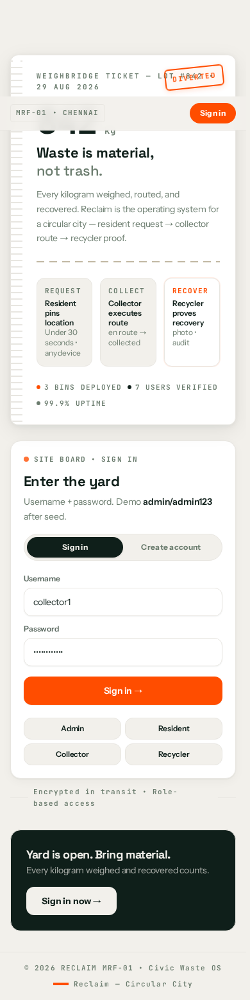
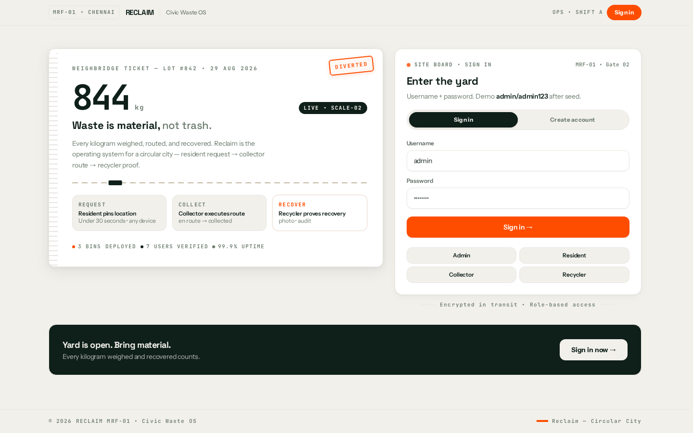
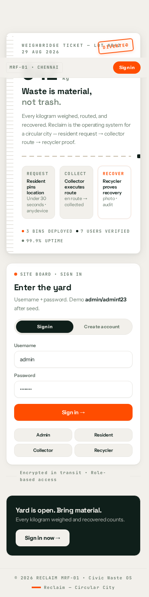

# Frontend — Unified Portal

> `React 19` `Vite 8` `Tailwind 4` `Leaflet` `Lucide` `React.lazy` `manualChunks`

**Single portal** `apps/web:5173` `App.tsx:116 role switch` `AppShell` `Sidebar + Drawer` `Bottom Nav ≤5`. Previous 4-port `four-separate-login-panel-model` branch.

**Live:** [`https://wms.getvoroa.com`](https://wms.getvoroa.com) (sign in: `admin` / `admin123`)

## Screenshots

| Role | Desktop | Mobile |
|------|---------|--------|
| Resident (`user`) |  |  |
| Collector (`collector`) |  |  |
| Recycler (`recycler`) |  |  |
| Admin (`management`) |  |  |

## Lazy & Chunks

`App.tsx:19 React.lazy(() => import('./features/resident/ResidentDashboard'))` `Suspense fallback={<LoadingScreen/>}` `ErrorBoundary` per `App.tsx:34` `withSuspense` + `chunk-reload` auto-reload on `Failed to fetch dynamically imported module`. `vite.config.ts:16 manualChunks(id) → react-vendor(194k) | leaflet(148k) | charts` `BinMap 20k`.

## Portal Routes (17)

| Role | `NavItem.href` `App.tsx:86` | `getTabFromPath()` |
|------|-----------------------------|--------------------|
| `user` | `/` Overview `analytics total_pickups` `DonutChart` `RecentActivity PickupCard` | `ResidentDashboard.tsx:101` |
| | `/new` New Pickup `wasteType × kg → CO₂` `MapPin pinpoint` | `96 includes('/new')` |
| | `/requests` My Requests `Paginated PickupCard detailed` | `97` |
| | `/rewards` My Rewards `RewardsSection` `balance/lifetime` `Voucher redeem` | `98` |
| | `/bins` Disposal Sites `BinMap` `6` | `99` |
| | `/account` Account `PUT /user/profile` | `100` |
| `collector` | `/queue` `available` `GET /collector/pickups/available` | `171` |
| | `/route` `My Route` `OSRM RouteMap` | `169` |
| | `/schedule` `date_from/to` | `170` |
| `recycler` | `/available` `Available Batches` | `128` |
| | `/my-batches` `requested/accepted` `Confirm Handover → Upload Proof` | `126` |
| | `/analytics` `Plant Analytics 25kg` `DonutChart` `Refresh` | `127` |
| `management` | `/` Overview `6 bins 45kg` | `114` |
| | `/sites` `PublicBins` `editable draggable` `pickupPin` | `115` |
| | `/users` `Provision Account` | `116` |
| | `/vouchers` `Rewards & Vouchers` | `117` |
| | `/audit` `Audit Log` | `118` |
| | `/reports` `7 CSV` | `119` |

## Maps

`BinMap.tsx:28 pickupPinIcon` red `#FF4D00` `PIN` `36px` `draggable` `onPickupDrag` `onPick` `ClickHandler` `MapRecenter` `getWasteTypeColor` (`organic #10B981` `plastic #3B82F6` `e-waste #8B5CF6` `metal #F97316`). `RouteMap.tsx:414` `accepted_waste_types ?? []` guard.

`ResidentDashboard.tsx:528` `Label Pin on map — drag pinpoint` `LazyBinMap pickupPin={[lat,lng]} onPickupDrag={setLatLng} onPick={setLatLng} height 420` `Tap to place • Drag pinpoint • Locate me` `useMyLocation` `Geolocation`. `ManagementDashboard.tsx:652` same for `binForm`.

## Design System

`@wm/shared` `tokens.css` `Cream #f5f3ed` `Fern #4a7c59` `Marigold #f9a620` `Ivory #faf9f6` `Space Grotesk / Instrument Sans / JetBrains Mono`. `primitives.tsx` `Button Input Card Badge Modal StatCard Switch` `cursor-pointer` `hover 200ms` `focus visible`.

## State

`useAuth` `token/refreshToken/role/user` `localStorage wm_*` `fetchMe` `packages/shared/src/auth.tsx:53 refresh()` `VITE_API_URL=""` same-port `fetch('/auth/login')` via `vite proxy` / `caddy` / `uvicorn` single-port.

## Charts

`DonutChart` `centerValue 25kg` `by_waste_type total_kg` `RadialGauge` `completionRate` `recharts` `D3` alternatives per `ui-ux-pro-max` `chart` domain.
